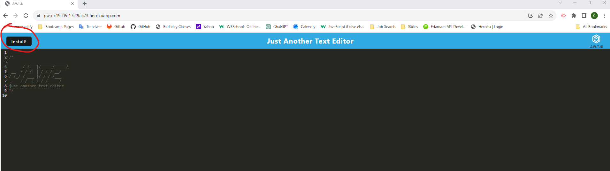
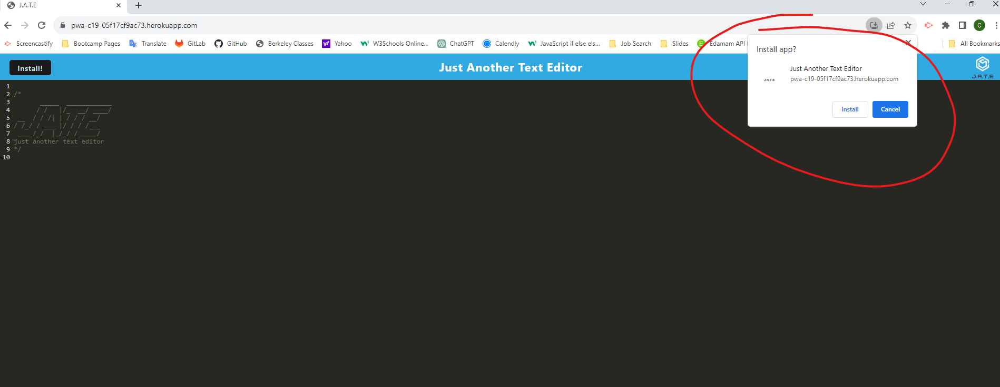
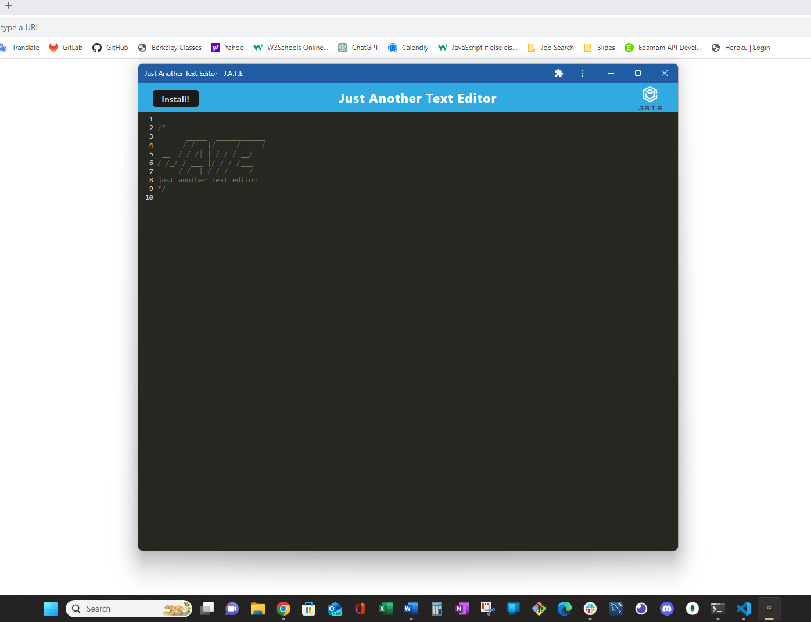

# 19 Progressive Web Applications (PWA): Text Editor

Deployed link for [PWA: Text Editor](https://pwa-c19-05f17cf9ac73.herokuapp.com/)

## Table of Contents (Optional)

* [Installation](#installation)
* [Usage](#usage)
* [Credits](#credits)
* [License](#license)

## Installation

#### This text editor is easy to install:

1. Click the [Install] button in the upper left corner of the screen:

2. When the install alert comes up in the upper right corner, click on the [Install] button:

3. After installation, it can be added as an app to your desktop or taskbar:

## Usage 

A Progressive Web Application or PWA text editor offers a cross-platform, offline capable, responsive text editing experience. With app-like features, real-time collaboration, cloud integration, and automatic updates, it provides a seamless and optimized user experience, reducing installation barriers and enabling document editing across various devices.

## Credits

* Git - [https://git-scm.com/](https://git-scm.com/)    
* Javascript - [https://developer.mozilla.org/en-US/docs/Web/JavaScript](https://developer.mozilla.org/en-US/docs/Web/JavaScript)
* jQuery - [https://jquery.com](https://jquery.com)
* Node.js - [https://nodejs.org/en](https://nodejs.org/en)
* Express 4.16.4 - [https://expressjs.com/](https://expressjs.com/)
* Heroku - [https://devcenter.heroku.com/categories/reference](https://devcenter.heroku.com/categories/reference)
* Babel - [https://babeljs.io/docs/](https://babeljs.io/docs/)
* Webpack - [https://webpack.js.org/concepts/](https://webpack.js.org/concepts/)

## License

[MIT License](https://github.com/microsoft/vscode/blob/main/LICENSE.txt) 

Copyright (c) 2023 Christina Larsen